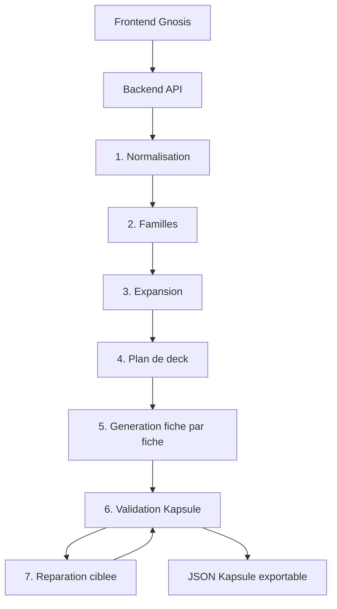

# Architecture - Gnosis

## Objectif

Construire une application web hebergeable qui genere des decks Kapsule valides
a partir de listes de sujets techniques. L'architecture doit rester simple,
mais le pipeline de generation doit etre assez robuste pour produire des
fiches completes, precises et structurees.

## Vue d'ensemble

## Composants

### Frontend

Responsabilites :

- Saisie multi-ligne des sujets.
- Chips de sujets detectes.
- Options de generation : langue et niveau d'apprentissage uniquement.
- Affichage du bilan de planification : fiches retenues, fusions, prerequis,
  extensions ecartees.
- Affichage du plan intermediaire.
- Etat d'avancement du pipeline.
- Apercu du deck final.
- Copie et telechargement du JSON.

Le frontend ne contient jamais la cle OpenAI.

### Backend

Responsabilites :

- Recevoir la demande de generation.
- Appeler OpenAI.
- Appliquer les schemas intermediaires.
- Valider le deck final.
- Relancer une reparation ciblee si necessaire.
- Retourner le deck et les erreurs exploitables.

Configuration attendue :

- `OPENAI_API_KEY`
- `OPENAI_MODEL`
- `MAX_CARDS` (plafond technique de fiches, pas une cible pedagogique)
- `MAX_INPUT_TOPICS`
- `OPENAI_DECK_BATCH_SIZE` (fiches par appel de redaction, 1 par defaut; 3 a valider contre l'API)
- `OPENAI_MAX_OUTPUT_TOKENS` (budget de sortie par fiche)
- `OPENAI_REASONING_EFFORT` (`minimal`, `low`, `medium`, `high`; non transmis si absent)
- `GNOSIS_TOKEN_BUDGET` (arret propre au-dela de N tokens; 0 = pas de borne)

### Schemas

Le systeme utilise deux familles de schemas :

- Schemas internes de pipeline : sujets normalises, familles, expansion, plan.
- Schema final Kapsule : deck JSON strict compatible avec Kapsule.

Le schema final doit rester aligne avec le contrat de Kapsule :

- `schemaVersion: 1`
- `id`, `title`, `description`, `tags`
- `cards[]`
- sections fermees : `intro`, `concept`, `example`, `takeaways`, `quiz`

## Pourquoi un pipeline multi-etapes

Un prompt unique est acceptable pour une demo courte, mais il concentre trop de
responsabilites dans un seul appel :

- organiser les sujets,
- deduire les notions proches,
- choisir un plan pedagogique,
- rediger toutes les fiches,
- produire un JSON strict,
- equilibrer les quiz.

Le pipeline separe ces decisions. Chaque etape produit une sortie plus petite,
plus facile a valider et a reparer.

## Contrats de sortie intermediaires

### Normalisation

Sortie attendue :

- sujets conserves,
- sujets fusionnes,
- synonymes,
- niveau de confiance,
- avertissements.

### Familles

Sortie attendue :

- familles,
- description courte,
- sujets rattaches,
- prerequis,
- ordre pedagogique.

### Expansion

Sortie attendue :

- notions ajoutees par famille,
- raison de l'ajout,
- niveau d'importance,
- notions exclues pour garder le scope.

### Plan de deck

Le plan ne recoit aucun nombre cible de fiches : il derive le nombre minimal de
fiches de la couverture progressive des notions saisies et de leurs prerequis
indispensables.

Sortie attendue :

- titre du deck,
- description,
- tags,
- bilan de planification : raison du plan, notions fusionnees, prerequis
  ajoutes et justifies, extensions ecartees,
- liste de fiches,
- objectif de chaque fiche et raison de son autonomie,
- origine de chaque fiche (notion saisie ou prerequis) et notion source,
- duree estimee,
- niveau,
- notions couvertes.

### Cout d'une generation

Chaque appel structure enregistre le `usage` renvoye par l'API : tokens d'entree,
d'entree en cache, de sortie et de raisonnement. La consommation est agregee par
etape, attachee au job au fil de l'eau et exposee dans le resultat, y compris
quand la generation echoue ou est annulee.

Leviers de cout appliques :

- l'etape Fiches ne recoit que l'expansion des familles couvertes par le lot,
- les fiches sont redigees par lots (`OPENAI_DECK_BATCH_SIZE`),
- l'effort de raisonnement est transmis seulement s'il est configure,
- `GNOSIS_TOKEN_BUDGET` arrete la generation avant depassement.

### Deck Kapsule

Sortie attendue :

- JSON final strictement conforme au schema Kapsule.
- Aucune propriete additionnelle.
- Chaque fiche terminee par un quiz.

## Validation

Validation obligatoire :

- JSON parseable.
- Schema final Kapsule.
- Unicite des ids de fiches.
- `quiz.answer` inferieur au nombre de choix.
- Longueurs compatibles avec Kapsule.

Validation pedagogique recommandee :

- Chaque notion d'entree est couverte ou explicitement exclue.
- Chaque famille a au moins une fiche.
- Aucun quiz ne depend d'une information absente de la fiche.
- Les fiches restent dans la duree cible.

## Reparation

La reparation doit etre ciblee :

- Si le JSON est invalide, envoyer uniquement les erreurs de validation et le
  fragment concerne.
- Si le contenu est faible, relancer la fiche ou la famille concernee.
- Eviter de regenerer tout le deck quand une seule fiche echoue.

## Securite

- La cle OpenAI reste cote serveur.
- Limiter taille d'entree, nombre de fiches et concurrence.
- Journaliser les erreurs techniques sans stocker inutilement les prompts
  utilisateurs.
- Prevoir un mode sans stockage pour le MVP.

## Hebergement

Le projet doit pouvoir etre heberge sur un site web classique :

- build frontend statique,
- backend API de generation,
- variables d'environnement serveur,
- HTTPS obligatoire en production.

Si l'hebergement final ne peut exposer qu'un site statique, il faudra deleguer
la generation a une fonction serverless ou a un backend separe.

## Tests attendus

- Tests unitaires des validateurs.
- Tests de transformation slug/id.
- Fixtures de decks valides et invalides.
- Test d'integration API avec mock OpenAI.
- Test visuel minimal du parcours frontend.

## Decisions d'architecture

- Pipeline multi-etapes par defaut.
- Structured outputs ou JSON Schema pour contraindre les reponses OpenAI.
- Validation locale non negociable avant export.
- Backend obligatoire pour proteger la cle API.
- Kapsule reste le contrat de sortie, Gnosis ne cree pas son propre format de
  deck final.

