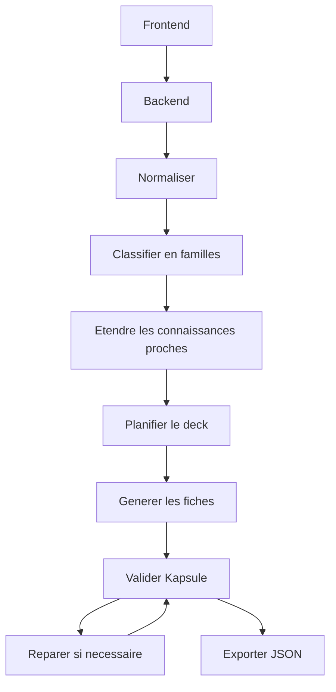

## adr_001_gnosis_pipeline_openai_kapsule - Pipeline OpenAI pour decks Kapsule
> Date: 2026-07-22
> Status: Accepted
> Drivers: precision pedagogique, conformite JSON Kapsule, cle OpenAI cote serveur, page web hebergeable
> Related request: `req_000_cadrer_et_construire_gnosis_generateur_de_decks_kapsule_par_pipeline_openai`
> Related backlog: `item_001_cadrer_et_construire_gnosis_generateur_de_decks_kapsule_par_pipeline_openai`
> Related task: `task_001_cadrer_et_construire_gnosis_generateur_de_decks_kapsule_par_pipeline_openai`
> Related product: `prod_001_gnosis_product_brief`
> Reminder: Update status, linked refs, decision rationale, consequences, and follow-up work when you edit this doc.

# Overview

Gnosis utilise un pipeline OpenAI multi-etapes pour transformer des sujets
techniques en deck Kapsule valide. La separation des etapes rend le systeme
plus precis, plus observable et plus reparable qu'un prompt unique.

# Context

- Le format Kapsule est strict et rejette les proprietes non prevues.
- Les sujets d'entree peuvent etre incomplets, redondants ou mal ordonnes.
- Le besoin met l'accent sur la precision et la completude pedagogique.
- La cle OpenAI doit rester protegee par un backend.
- Le projet doit etre heberge sur un site web avec une page relativement
  stylisee.

# Decision

- Retenir un pipeline multi-etapes :
  1. normalisation,
  2. familles,
  3. expansion,
  4. plan,
  5. generation fiche par fiche,
  6. validation,
  7. reparation ciblee.
- Utiliser des schemas de sortie structures pour les etapes intermediaires.
- Utiliser le schema Kapsule comme contrat final.
- Valider localement avant d'autoriser le telechargement ou la copie du deck.
- Faire transiter tous les appels OpenAI par le backend.

# Consequences

- Plus d'appels OpenAI qu'un prompt unique, donc latence et cout plus eleves.
- Meilleure qualite et meilleure capacite a corriger une seule partie du deck.
- Le plan intermediaire peut devenir une surface UX utile.
- Les tests peuvent couvrir chaque etape avec des fixtures.

# Requirements

- Endpoint backend de generation.
- Schemas internes de pipeline.
- Validateur final Kapsule.
- Gestion des erreurs et reparation ciblee.
- Frontend avec progression visible par etape.
- Export JSON final.

# Risks

- Les domaines tres pointus peuvent necessiter des sources externes.
- Trop d'expansion peut creer un deck hors scope.
- Les limites de tokens peuvent imposer une generation fiche par fiche.
- Les schemas trop stricts peuvent reduire la qualite redactionnelle s'ils sont
  mal concus.

# Follow-up work

- Definir les schemas intermediaires.
- Scaffolder le frontend et le backend.
- Ajouter fixtures Kapsule valides/invalides.
- Mettre en place un mock OpenAI pour les tests.

# References

- Product brief: `prod_001_gnosis_product_brief`
- Product doc: `docs/product.md`
- Architecture doc: `docs/architecture.md`

