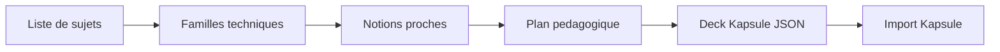

## prod_001_gnosis_product_brief - Gnosis product brief
> Date: 2026-07-22
> Status: Proposed
> Related request: `req_000_cadrer_et_construire_gnosis_generateur_de_decks_kapsule_par_pipeline_openai`
> Related backlog: `item_001_cadrer_et_construire_gnosis_generateur_de_decks_kapsule_par_pipeline_openai`
> Related task: `task_001_cadrer_et_construire_gnosis_generateur_de_decks_kapsule_par_pipeline_openai`
> Related architecture: `adr_001_gnosis_pipeline_openai_kapsule`
> Reminder: Update status, linked refs, scope, decisions, success signals, and open questions when you edit this doc.

# Overview

Gnosis est un outil web qui transforme une liste de sujets techniques en deck
Kapsule complet : regroupement en familles, enrichissement par notions proches,
generation de fiches de cours et quiz, puis export JSON importable.

# Goals

- Produire des decks Kapsule precis a partir d'une liste imparfaite de notions.
- Rendre visible le plan intermediaire avant generation finale.
- Maximiser la couverture des notions proches sans diluer le scope.
- Garantir une sortie JSON conforme au schema Kapsule.
- Garder une experience web stylisee, claire et directement utilisable.

# Non-goals

- Remplacer Kapsule comme lecteur de fiches.
- Construire un LMS complet.
- Gerer comptes, paiement ou collaboration dans le MVP.
- Exposer la cle OpenAI cote navigateur.
- Faire une recherche web automatique obligatoire dans le MVP.

# Scope and guardrails

- In: saisie de sujets, options de generation, pipeline OpenAI, validation,
  reparation ciblee, export JSON Kapsule.
- Out: import direct distant dans Kapsule tant que les contrats d'auth/API ne
  sont pas fixes.
- Guardrail: une sortie non valide ne doit jamais etre presentee comme prete a
  importer.

# Key product decisions

- Le pipeline multi-etapes est retenu plutot qu'un prompt unique.
- Le plan intermediaire est un objet produit important, pas un detail technique.
- La sortie finale reste strictement le format Kapsule `schemaVersion: 1`.
- La precision pedagogique prime sur la vitesse brute de generation.

# Success signals

- Le deck final passe la validation Kapsule sans retouche.
- L'utilisateur reconnait ses sujets d'entree et les notions proches utiles.
- Chaque fiche a un quiz pertinent et explicable.
- Le parcours complet reste comprehensible meme en cas d'erreur OpenAI.

# References

- Product doc: `docs/product.md`
- Architecture doc: `docs/architecture.md`

