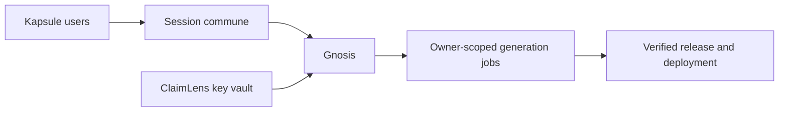

## prod_003_gnosis_avec_identite_commune_et_cle_openai_reutilisable - Gnosis avec identite commune et cle OpenAI reutilisable
> Date: 2026-07-26
> Status: Settled
> Related request: `req_004_federer_gnosis_aux_comptes_communs_et_au_coffre_openai_partage`
> Related backlog: `item_007_definir_et_migrer_le_coffre_openai_commun_aux_comptes_kapsule`
> Related task: `task_005_orchestrer_l_identite_commune_et_la_release_gnosis`
> Related architecture: (none yet)
> Reminder: Update status, linked refs, scope, decisions, success signals, and open questions when you edit this doc.

# Overview
Gnosis rejoint l'identite Kapsule/ClaimLens et reutilise un coffre OpenAI commun sans exposer les secrets.

# Goals
- Supprimer la friction de ressaisie de cle pour les utilisateurs deja equipes dans ClaimLens.
- Maintenir un parcours invite BYOK non persistant.
- Conserver un cloisonnement strict des jobs et des cles.
- Rendre la version et le retour au site paulmondou immediatement visibles.
- Livrer une release reproductible et verifiee jusqu'au deploiement.

# Non-goals
- Ajouter OAuth, SSO tiers ou inscription publique dans Gnosis.
- Partager une cle OpenAI entre plusieurs comptes.
- Utiliser une cle OpenAI serveur pour financer les generations des utilisateurs.
- Afficher, exporter ou stocker une cle ponctuelle invitee.

# Scope and guardrails
- In: scaffolded request, product, backlog, orchestration task, validation, and handoff context.
- Out: unrelated workflow docs and implementation of generated tasks.

# Key product decisions
- Use structured input as the source of truth for generated docs.
- Keep generated write paths local and repo-bounded.

# Success signals
- Generated docs pass lint and audit without broad manual rewrites.
- Context-pack output can be handed to an implementation agent directly.

# References
- Product back-reference: `item_007_definir_et_migrer_le_coffre_openai_commun_aux_comptes_kapsule`
- Task back-reference: `task_005_orchestrer_l_identite_commune_et_la_release_gnosis`
