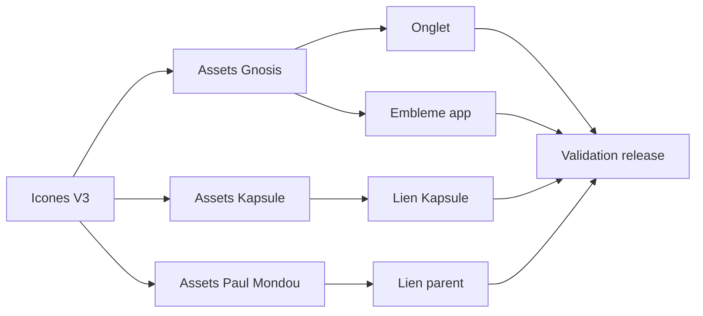

## prod_004_identite_gnosis_alignee_sur_icones_v3 - Identite Gnosis alignee sur Icones V3
> Date: 2026-08-05
> Status: Settled
> Related request: `req_005_integrer_les_icones_icones_v3_et_les_liens_kapsule_paul_mondou_dans_gnosis`
> Related backlog: `item_011_remplacer_favicon_et_embleme_gnosis_par_icones_v3`
> Related task: `task_006_orchestrer_l_integration_icones_v3_dans_gnosis`
> Related architecture: (none yet)
> Reminder: Update status, linked refs, scope, decisions, success signals, and open questions when you edit this doc.

# Overview
Gnosis expose les assets Gnosis Icones V3 et des liens visuels coherents vers Kapsule et Paul Mondou.

# Goals
- Aligner l'onglet, l'embleme et les liens transverses sur Icones V3.
- Preserver la comprehension du role de Kapsule dans le parcours Gnosis.
- Limiter les changements a la marque, aux assets et aux liens.

# Non-goals
- Modifier le pipeline OpenAI ou la generation de decks.
- Changer les modeles de compte, de coffre de cle ou d'authentification.

# Scope and guardrails
- In: scaffolded request, product, backlog, orchestration task, validation, and handoff context.
- Out: unrelated workflow docs and implementation of generated tasks.

# Key product decisions
- Use structured input as the source of truth for generated docs.
- Keep generated write paths local and repo-bounded.

# Success signals
- Generated docs pass lint and audit without broad manual rewrites.
- Context-pack output can be handed to an implementation agent directly.

# References
- Product back-reference: `item_011_remplacer_favicon_et_embleme_gnosis_par_icones_v3`
- Task back-reference: `task_006_orchestrer_l_integration_icones_v3_dans_gnosis`
