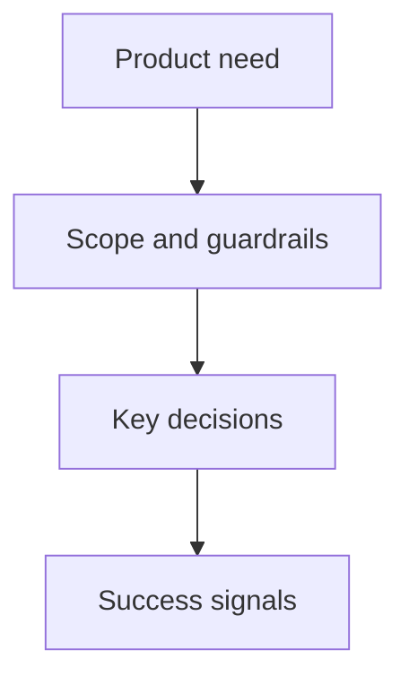

## prod_005_publier_les_derniers_assets_icones_v3_gnosis - Publier les derniers assets Icones V3 Gnosis
> Date: 2026-08-06
> Status: Proposed
> Related request: `req_006_publier_les_derniers_assets_icones_v3_gnosis`
> Related backlog: `item_013_publier_les_derniers_assets_icones_v3_gnosis`
> Related task: (none yet)
> Related architecture: (none yet)
> Reminder: Update status, linked refs, scope, decisions, success signals, and open questions when you edit this doc.

# Overview
- Gnosis aligne les quatre masters Icones V3 importés par son client afin de préserver une identité cohérente dans les deux thèmes.

# Goals
- (goal to document)

# Non-goals
- (non-goal to document)

# Scope and guardrails
- In: (to document)
- Out: (to document)

# Key product decisions
- (decision to document)

# Success signals
- (success signal to document)

# References
- Product back-reference: `item_013_publier_les_derniers_assets_icones_v3_gnosis`
- Task back-reference: (none yet)
