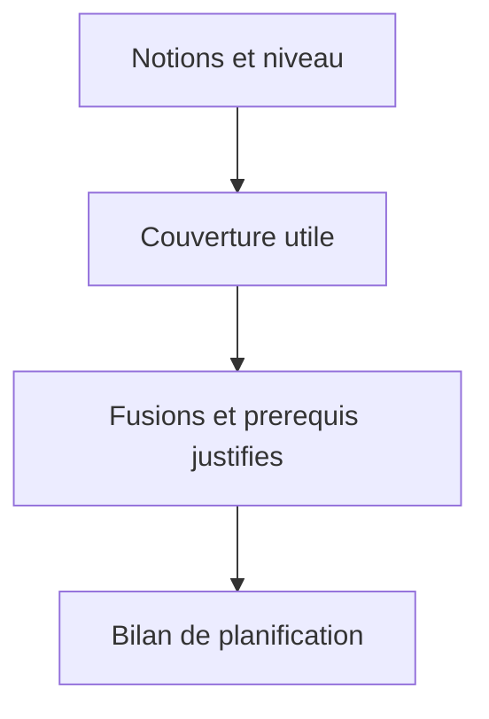

## prod_007_generation_gnosis_pilotee_par_la_couverture_pedagogique - Generation Gnosis pilotee par la couverture pedagogique
> Date: 2026-08-07
> Status: Settled
> Related request: `req_010_rendre_la_granularite_pedagogique_de_gnosis_entierement_automatique`
> Related backlog: `item_018_remplacer_le_quota_de_fiches_par_un_contrat_de_granularite_automatique`
> Related task: `task_011_livrer_la_generation_gnosis_a_granularite_automatique`
> Related architecture: (none yet)
> Reminder: Update status, linked refs, scope, decisions, success signals, and open questions when you edit this doc.

# Overview
Gnosis choisit seul la granularite utile d'un deck a partir des notions et du niveau voulu. Le produit vise une comprehension juste : ni decoupage artificiel, ni resume appauvri, ni extension decorative.

# Goals
- Faire du niveau d'apprentissage le principal signal de profondeur pedagogique.
- Produire le minimum de fiches utiles, avec une couverture explicable et sans redondance.
- Rendre visibles les decisions de planification qui modifient le perimetre initial.

# Non-goals
- Donner a l'utilisateur un controle manuel du nombre de fiches, de mots ou de minutes.
- Couvrir exhaustivement un domaine entier lorsque seules quelques notions ont ete demandees.
- Ajouter des notions connexes pour enrichir artificiellement le deck.

# Scope and guardrails
- In: scaffolded request, product, backlog, orchestration task, validation, and handoff context.
- Out: unrelated workflow docs and implementation of generated tasks.

# Key product decisions
- Use structured input as the source of truth for generated docs.
- Keep generated write paths local and repo-bounded.

# Success signals
- Generated docs pass lint and audit without broad manual rewrites.
- Context-pack output can be handed to an implementation agent directly.

# References
- Product back-reference: `item_018_remplacer_le_quota_de_fiches_par_un_contrat_de_granularite_automatique`
- Task back-reference: `task_011_livrer_la_generation_gnosis_a_granularite_automatique`
