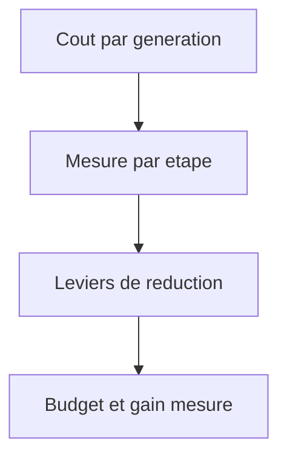

## prod_008_generation_gnosis_a_cout_maitrise - Generation Gnosis a cout maitrise
> Date: 2026-08-07
> Status: Proposed
> Related request: `req_013_maitriser_le_cout_des_appels_openai_d_une_generation_gnosis`
> Related backlog: `item_022_mesurer_la_consommation_de_tokens_de_chaque_etape_de_generation`, `item_023_reduire_le_cout_d_une_generation_a_couverture_pedagogique_constante`
> Related task: `task_014_livrer_la_maitrise_du_cout_des_generations_gnosis`
> Related architecture: (none yet)
> Reminder: Update status, linked refs, scope, decisions, success signals, and open questions when you edit this doc.

# Overview
Gnosis doit rester utilisable sans surprise de facturation: une generation annonce ce qu'elle coute, consomme ce qui est necessaire a la couverture pedagogique, et rien de plus.

# Goals
- Rendre la consommation d'une generation observable avant de chercher a la reduire.
- Reduire le cout par deck a couverture constante.
- Donner a l'operateur une borne de budget explicite.

# Non-goals
- Reduire le nombre de fiches ou la profondeur pedagogique pour economiser des tokens.
- Changer de fournisseur de modele.
- Facturer ou refacturer les utilisateurs.

# Scope and guardrails
- In: scaffolded request, product, backlog, orchestration task, validation, and handoff context.
- Out: unrelated workflow docs and implementation of generated tasks.

# Key product decisions
- Use structured input as the source of truth for generated docs.
- Keep generated write paths local and repo-bounded.

# Success signals
- Generated docs pass lint and audit without broad manual rewrites.
- Context-pack output can be handed to an implementation agent directly.

# References
- Product back-reference: `req_013_maitriser_le_cout_des_appels_openai_d_une_generation_gnosis`
- Task back-reference: `task_014_livrer_la_maitrise_du_cout_des_generations_gnosis`
